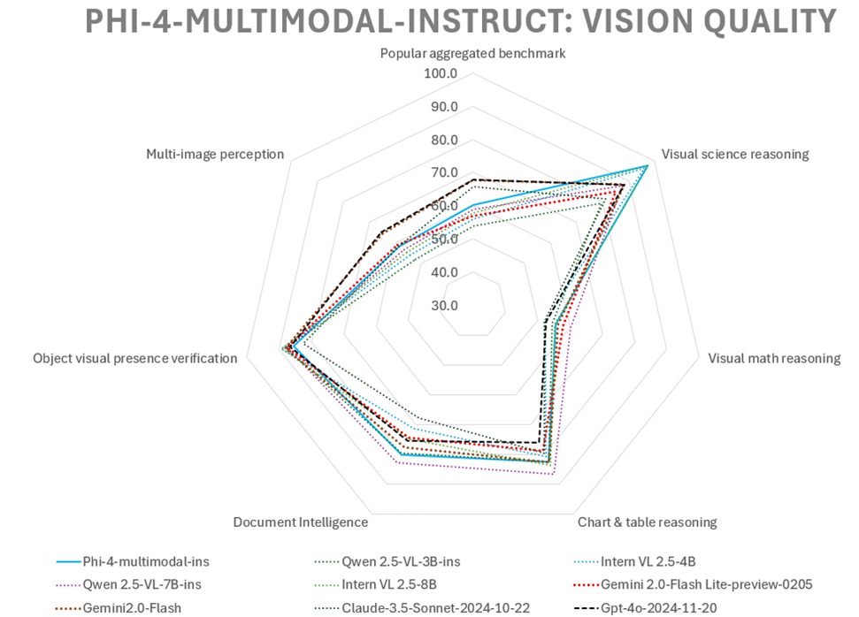

# W2 Data Extraction with Qwen-2.5-VL-7B-Instruct

## Executive Summary
This project demonstrates how fine-tuning the Qwen-2.5-VL-7B-Instruct model on the Kaggle W2 dataset achieves a 97.23% accuracy in automating the extraction of several key fields, all at a trivial development cost. This result suggests that business use cases that rely on heavy text extraction from documents, such as mortgage underwriting, can be automated with current open source vision-language models as they offer a scalable and efficient alternative to manual or traditional OCR-based methods. The model excels across four W2 form types--herein defined as ADP1, ADP2, IRS1, and IRS2--with near-perfect performance on the IRS class of forms (99.69%-100% accuracy) and significant improvements on the more complex ADP forms, particularly ADP1 (from 52.92% to 89.23%). This highlights the transformative potential of vision-language models for document extraction in financial workflows.

---

## Introduction

### Business Use Case of Document Extraction
In mortgage underwriting, as an example, extracting data from W2 forms is critical for verifying income and tax details. Traditionally, this process involved manual data entry, which is time-consuming, expensive, and prone to human error. Automating W2 extraction with AI not only accelerates the process but also reduces costs and speed, delivering substantial value to financial institutions by enhancing operational efficiency and decision-making reliability. The key question is whether the state-of-the-art is sufficiently accurate to enable adoption. 

### State of the Art in Vision-Language Models
The field of document extraction has evolved significantly, with vision-language models (VLMs) like Qwen-2.5-VL-7B-Instruct marking a major advancement over traditional methods:

- **Traditional Approaches**: Historically, document extraction relied on rule-based systems and Optical Character Recognition (OCR) tools. These methods excel with simple, predictable layouts but falter with complex documents like W2 forms, where varied layouts, dense text, and inconsistent formatting demand frequent manual correction. Their rigidity limits scalability and adaptability, often resulting in higher operational costs.
  
- **Emergence of VLMs**: Modern VLMs integrate visual understanding with natural language processing, enabling them to interpret both the text and structural layout of documents. Unlike OCR, which merely transcribes text, VLMs can contextualize information, making them exceptionally suited for complex, structured documents.

- **Qwen-2.5-VL-7B-Instruct Overview**: Released in January 2025, Qwen-2.5-VL-7B-Instruct is a 7-billion-parameter VLM optimized for document parsing. It builds on advancements in multi-modal learning, offering robust performance on dense, structured text while remaining lightweight enough for fine-tuning on modest hardware. Its open-source availability further enhances its appeal, reducing dependency on proprietary solutions.

- **Why Qwen-2.5-VL-7B-Instruct?**: This model was selected for several reasons:
  - **Performance on Complex Documents**: Its ability to process varied layouts and dense text outperforms traditional OCR and earlier VLMs, making it ideal for W2 forms.
  - **Cost-Effectiveness**: Fine-tuning a 7B-parameter model is computationally feasible (e.g., on an A100 GPU), unlike larger proprietary models, keeping costs low (~$10 in GPU cost for this project on Colab).
  - **Open-Source Advantage**: Being open-source allows customization and avoids licensing fees, contrasting with closed systems like Google Document AI or AWS Textract.
  - **Comparison to Alternatives**: Compared to traditional OCR (error-prone with layout changes) and other VLMs, Qwen-2.5-VL-7B-Instruct strikes a balance between accuracy, adaptability, and affordability.
 
### Comparison to Other Recent Models
In February 2025, Microsoft released its family of Phi-4 multimodal models, including it's Phi-4-multimodal-instruct version. On the HuggingFace model card, focusing on [vision tasks](https://huggingface.co/microsoft/Phi-4-multimodal-instruct#vision-tasks), the authors compare the performance of Phi-4-multimodal-instruct with other models. Notably, Qwen-2.5-VL-7B-Instruct outperformed the others on 5 of 6 benchmarks related to "Chart and Table Reasoning" and "Document Intelligence". These results further reinforced the choice of using the Qwen-2.5-VL model for this project. A visual representation is summarized in this radar chart for vision quality:

---
## Project Overview

### Applying Qwen-2.5-VL-7B-Instruct to W2 Extraction
This project harnesses Qwen-2.5-VL-7B-Instruct to extract structured data from W2 forms, directly addressing the needs of mortgage underwriting. We fine-tune the model using QLoRA (Quantized Low-Rank Adaptation) to enhance its accuracy on this specific task.

### Dataset Choice
The project utilizes the [mcvishnu1/fake-w2-us-tax-form-dataset](https://www.kaggle.com/mcvishnu1/fake-w2-us-tax-form-dataset) from Kaggle, a synthetic dataset comprising 1000 examples of W2 forms, including four distinct form types split into two categories:

- **ADP-Based Forms**:
  - **ADP1**: Modeled after ADP W2s, ADP1 is the most challenging due to its complex layout, duplicated forms, and varied field placements ([example](img/adp1_example.png)).
  - **ADP2**: Also ADP-based, but focused on a single form without duplication, making it easier to process ([example](img/adp2_example.png)).

- **IRS Forms**:
  - **IRS1**: An IRS 2019 W2 form with multiple copies of the form. Highly standardized with consistent formatting and clear field labels ([example](img/irs1_example.png)).
  - **IRS2**: Another IRS W2 variant, but for 2018, and without form duplication ([example](img/irs2_example.png)).

This dataset was chosen over alternatives like the [SROIE dataset](https://paperswithcode.com/dataset/sroie) (focused on receipts) because w2 data extraction aligns closely with financial document extraction needs in mortgage underwriting, offering a realistic mix of complexity and standardization.

### Notebook Overview
The workflow is divided into three Jupyter notebooks:
- **`01_w2_dataset_preprocessing.ipynb`**: Prepares the Kaggle dataset for model input.
- **`02_zero_shot_baseline.ipynb`**: Establishes a baseline via zero-shot inference.
- **`03_qlora_fine_tuning.ipynb`**: Fine-tunes the model with QLoRA for optimal performance.
- **`04_llama_extract_eval.ipynb`**: Performs document extraction using the LlamaExtract cloud service.

---

## Performance Improvements

### Overall Performance
- **Zero-Shot Baseline Accuracy**: 87.23%
- **Fine-Tuned Accuracy**: 97.23%
- **Training Details**: Fine-tuning was conducted over 10 epochs on an A100 GPU (40GB GPU RAM, 80GB system RAM) in Google Colab, requiring 5-6 hours.
- **Cost**: Approximately $10 end-to-end across development, underscoring the project’s affordability.

### Form-Type Performance
The dataset’s four W2 form types present varying challenges, with performance improving significantly after fine-tuning:

- **ADP1**:
  - **Zero-Shot Accuracy**: 52.92%
  - **Fine-Tuned Accuracy**: 89.23%
  - **Improvement**: +36.31%
  - **Analysis**: ADP1 exhibited the lowest baseline performance due to its complexity—varied layouts, dense text, and unique formatting (e.g., inconsistent fonts or field spacing). Fine-tuning adapted the model to these nuances, though it still falls short of perfection, suggesting room for further optimization.

- **ADP2**:
  - **Zero-Shot Accuracy**: 100%
  - **Fine-Tuned Accuracy**: 100%
  - **Improvement**: None (already optimal)
  - **Analysis**: ADP2’s standardized layout enabled flawless zero-shot performance, which fine-tuning maintained.

- **IRS1**:
  - **Zero-Shot Accuracy**: 100%
  - **Fine-Tuned Accuracy**: 100%
  - **Improvement**: None (already optimal)
  - **Analysis**: In a somewhat surprising result, this more complex version of the IRS dataset achieved flawless zero-shot performance, which fine-tuning also maintained. 

- **IRS2**:
  - **Zero-Shot Accuracy**: 96%
  - **Fine-Tuned Accuracy**: 99.69%
  - **Improvement**: +3.69%
  - **Analysis**: IRS2 achieved near-perfect results, with the sole fine-tuned error being a "c" misread as "C".

### Why ADP1 Was Challenging
ADP1’s poor zero-shot performance stems from several factors:
- **Layout Complexity**: multiple, duplicated forms and a complex layout make this version the most difficult to process.

Fine-tuning mitigated these issues by tailoring the model to ADP1’s characteristics, though its 89.23% accuracy indicates lingering difficulties.

For detailed field-level metrics, see the `reports/` directory.

## Comparison to LlamaExtract Cloud Service

To evaluate the effectiveness of the fine-tuned Qwen-2.5-VL-7B-Instruct model, we compared its performance against the LlamaExtract cloud service, a general-purpose document extraction tool, using the same W2 dataset. This comparison provides insight into how a task-specific, fine-tuned model stacks up against an off-the-shelf cloud solution. The results demonstrate significant performance differences, underscoring the superiority of the fine-tuned model for W2 data extraction.

### Overall Accuracy

The fine-tuned **Qwen-2.5-VL** model achieves a substantially higher overall accuracy of **97.23%** compared to **LlamaExtract**'s **70.75%**. This **26.48%** improvement highlights the fine-tuned model's reliability, making it a stronger candidate for production environments where precision is critical, such as mortgage underwriting.

### Form-Type Performance

The W2 dataset includes four form types—ADP1, ADP2, IRS1, and IRS2—each presenting unique challenges. The performance breakdown reveals stark contrasts:

| Form Type | Fine-Tuned Qwen-2.5-VL Accuracy | LlamaExtract Accuracy |
|:----------|:-------------------------------:|:---------------------:|
| ADP1      | 89.23%                          | 95.67%                |
| ADP2      | 100%                            | 97.33%                |
| IRS1      | 100%                            | 47%                   |
| IRS2      | 99.69%                          | 43%                   |

**Key Finding**: LlamaExtract performs well on ADP forms (95.67% for ADP1 and 97.33% for ADP2) but struggles significantly with IRS forms, achieving only 47% accuracy for IRS1 and 43% for IRS2. In contrast, the fine-tuned Qwen-2.5-VL model excels across all form types, with near-perfect accuracy on IRS forms (100% and 99.69%) and strong performance on ADP forms, including the complex ADP1 (89.23%). This demonstrates the fine-tuned model's ability to handle diverse and challenging document layouts effectively.

---

## How to Use the Project

### Setup Instructions

This project is intended to be executed through the notebooks. All three work on Google Colab. The first also works locally (I had issues installing Qwen model binaries on my Mac, so I did all developemnnt for notebooks 2 and 3 on Colab.)

The process is as follows: 
- Open a notebook in [Google Colab](https://colab.research.google.com/) by navigating to the Github repo at `https://github.com/chrisalehman/ai-document-extraction`. 
  - Select one of the three notebooks. You'll need to execute notebook 1 before 2 or 3 to download and preprocess the dataset. 
- Go to "Runtime" > "Change runtime type."
  - For notebook 1: `High-RAM` works perfectly well and is recommended to save cost. 
  - For notebooks 2-3: `Nvidia A100` is recommended as the notebooks are GPU-intensive and were designed to work with this setting. 
- Start a terminal session in Colab, and clone the GitHub project into the base directory `/content`, or a directory of your choosing. Command: `git clone https://github.com/chrisalehman/ai-document-extraction`.
  - Create a .env.colab file with the required environment variables. See the `example.env` file for an example.
- Start executing the notebook. 

## Project Structure

The project directory is organized as follows:

- **`config/`**: Contains system and user prompts. 
- **`notebooks/`**: Core notebooks:
  - `01_w2_dataset_preprocessing.ipynb`
  - `02_zero_shot_baseline.ipynb`
  - `03_qlora_fine_tuning.ipynb`
- **`scripts/`**: Utility scripts (e.g., `setup_venv.sh` for setting up a virtual environment locally).
- **`src/`**:
  - **`model/`**: Model-related helper functions (e.g., `qwen_vl_model_adapter.py`, `reporting.py`).
  - **`utils/`**: General helper functions (e.g., `w2_dataset.py`, `data_loader.py`).
- **`reports/`**: Detailed performance reports. 
- **`example.env`**: Example environment file. 
- **`requirements-colab.txt`, `requirements-local.txt`**: Defines Python packages required for the project. 

## Notes

- **Prerequisites**: A persistent data store is needed for saving datasets, models, and reports across notebook executions. Google Drive access is assumed to be available for Colab-based workflows. 
- **Detailed Metrics**: For field-level and form-type accuracy breakdowns, refer to the `reports/` directory.
